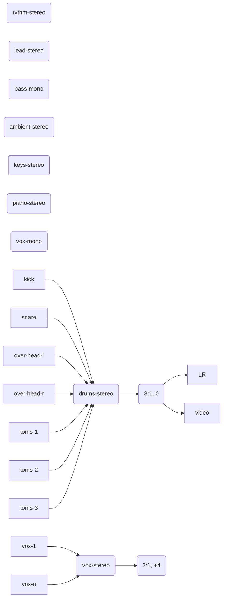

```mermaid
graph LR

drums(drums-stereo)
rythm(rythm-stereo)
lead(lead-stereo)
bass(bass-mono)
amb(ambient-stereo)
keys(keys-stereo)
piano(piano-stereo)
vox(vox-stereo)
vox-vo(vox-mono)

kick --> drums
snare --> drums
over-head-l --> drums
over-head-r --> drums
toms-1-->drums
toms-2-->drums
toms-3-->drums

vox-1-->vox
vox-n-->vox

drums-->drums-compressor(3:1, 0)
vox --> vox-compressor(3:1, +4)

drums-compressor-->LR
drums-compressor-->video


```
