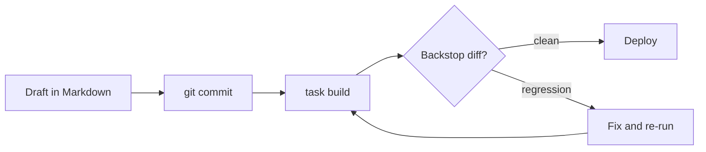
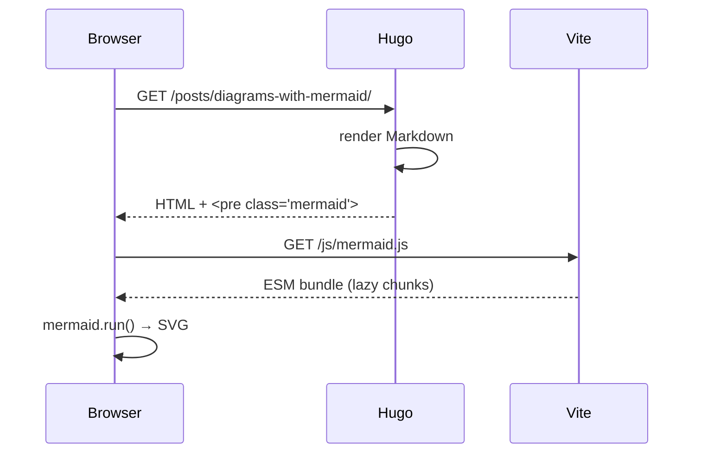
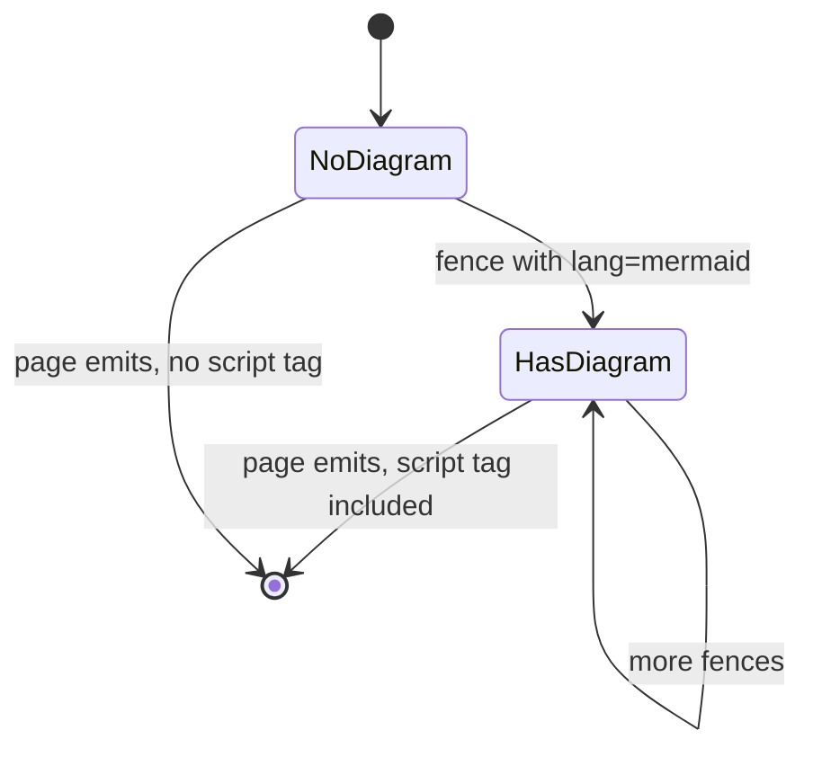

# Diagrams with Mermaid

| key | value |
| --- | --- |
| url | http://localhost:1313/posts/2026/05/23/diagrams-with-mermaid/ |
| date | 2026-05-23 |
| category | Tooling |
| tags | mermaid, diagrams, tutorial |
| description | How to drop a diagram into a post without leaving Markdown. |

Most of the diagrams I want in a blog post are small — a flow, a sequence, the shape of a state machine. Reaching for Figma or draw.io for these is overkill. Mermaid lets me write them in the same fenced code blocks I already use for code.

## Flowchart

The publish path for a post in this repo:

## Sequence

A request through the dev stack:

## State

The tiny state machine inside the codeblock render hook:

That's it — three diagrams, zero JavaScript written by hand, and the Mermaid runtime is only loaded on pages (like this one) that actually need it.

