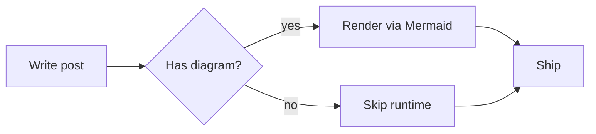

# Style Guide

| key | value |
| --- | --- |
| url | http://localhost:1313/styleguide/ |
| date | 2026-05-12 |
| description | Living reference for every component and type style in the Frobiovox theme. |


This page demonstrates every visual element defined in `DESIGN.md`. If you change a token or a component, check this page renders correctly before merging.

## Typography

# Heading 1 — VT323, 40px

## Heading 2 — IBM Plex Sans, 24px

### Heading 3 — IBM Plex Sans, 20px

#### Heading 4 — IBM Plex Sans, 18px, muted

Body copy is set in **Raleway** at 18px / 1.7 line-height. The point of this paragraph is to give you a long enough stretch of text to feel the reading rhythm. *Italics* and **bold** should sit comfortably inside the run without jumping out, and a [link looks like this](#) — the only saturated color in the system.

> A blockquote sits inside the column with a 2px rule on the left, italic, and a slightly larger size. Use it for pulled quotes, not for asides or callouts.

Inline `code` snippets render in the default monospace, no background tint. For fenced code blocks see the Code section below.

## Hero banner

When a post sets `hero` in frontmatter, the title, date, category, and tags are overlaid on the image with a bottom-anchored gradient scrim. The scrim keeps the text legible regardless of the image behind it.

<div class="post-hero-wrap">
  
  <div class="post-hero-overlay">
    <h1 class="post-hero-title">An Example Post Title</h1>
    <div class="post-hero-meta">
      <time datetime="2026-05-23">May 23, 2026</time> · Updated <time datetime="2026-05-24">May 24, 2026</time>
    </div>
    <div class="post-hero-badges">
      <span class="badge badge-outline">Field Notes</span>
    </div>
    <div class="post-hero-badges flex flex-wrap gap-1">
      <span class="badge">cats</span>
      <span class="badge">photography</span>
      <span class="badge">lorem</span>
    </div>
  </div>
</div>

Frontmatter:

```yaml
hero: "https://placecats.com/1200/420"
hero_alt: "A cat stretched across a sunlit windowsill"
hero_caption: "Optional caption — sits below the image in muted italic."
```

## Color

The palette is small on purpose. If you find yourself reaching for a color outside this list, stop and reconsider.

<div style="display: grid; grid-template-columns: repeat(4, 1fr); gap: 8px; margin: 1em 0;">
  <div style="background:#eee; padding:1em; text-align:center; color:#333; border:1px solid #ddd;">#eee<br><small>page bg</small></div>
  <div style="background:#fff; padding:1em; text-align:center; color:#333; border:1px solid #ddd;">#fff<br><small>content</small></div>
  <div style="background:#333; padding:1em; text-align:center; color:#fff;">#333<br><small>ink</small></div>
  <div style="background:#222; padding:1em; text-align:center; color:#fff;">#222<br><small>heading</small></div>
  <div style="background:#666; padding:1em; text-align:center; color:#fff;">#666<br><small>muted</small></div>
  <div style="background:#ddd; padding:1em; text-align:center; color:#333;">#ddd<br><small>border</small></div>
  <div style="background:#4183c4; padding:1em; text-align:center; color:#fff;">#4183c4<br><small>link</small></div>
  <div style="background:#000; padding:1em; text-align:center; color:#fff;">#000<br><small>nav strip</small></div>
</div>

## Badges

Used for categories and tags on post pages and listing cards.

<div class="flex flex-wrap gap-1 mb-2">
  <span class="badge">default</span>
  <span class="badge">threejs</span>
  <span class="badge">tutorial</span>
  <span class="badge">frontpage</span>
</div>

<div class="mb-2">
  <span class="badge badge-outline">Outline / category</span>
</div>

## Cards

Cards are how posts surface on list pages. The whole card is the affordance; the title is the link.

<div class="card" style="max-width: 100%; margin: 1em 0;">
  <div class="card-header">
    <div class="card-title"><a href="#">Example post title goes right here</a></div>
    <div class="card-description">A one-line description sits in muted-foreground so the title stays dominant.</div>
  </div>
  <div class="card-content">
    <div class="date">January 12, 2026</div>
    <div class="mb-2 mt-2">
      <span class="badge badge-outline">New Web</span>
    </div>
    <div class="flex flex-wrap gap-1 mb-2">
      <span class="badge">threejs</span>
      <span class="badge">tutorial</span>
    </div>
  </div>
</div>

## Author byline

VT323 on a dark block — same visual contract as the read-more button.

<span class="author-info">posted by frobiovox</span>

## Inline aside

A terminal-prompt-styled aside. Use sparingly for editorial notes inline with prose.

<aside class="inline">
This is what an inline aside looks like — a muted block flagged with a giant <code>&gt;</code> prompt glyph on the left. It is for short editorial notes that interrupt the main read without breaking it.
</aside>

## Lists

Unordered:

- First item in the list
- Second item, with **emphasis** somewhere inside
  - A nested item drops to a circle marker
  - Nesting deeper keeps the same indent rhythm
- Third item

Ordered:

1. Steps go like this
2. Numbered, decimal, default indent
3. Predictable

## Code

Fenced code blocks get Solarized highlighting, a soft shadow, and horizontal scroll on long lines (intentional — wrapping breaks code alignment).

```javascript
// three.js scene setup — long lines do not wrap, they scroll
const scene = new THREE.Scene();
const camera = new THREE.PerspectiveCamera(75, window.innerWidth / window.innerHeight, 0.1, 1000);
const renderer = new THREE.WebGLRenderer({ antialias: true });
renderer.setSize(window.innerWidth, window.innerHeight);
document.body.appendChild(renderer.domElement);

function animate() {
    requestAnimationFrame(animate);
    renderer.render(scene, camera);
}
animate();
```

```bash
# task verify:llm — runs the JSON-LD / llms.txt sanity checks in a container
task verify:llm
```

## Images

Four image roles are supported. All cat photos below are Creative Commons placeholders served from [placecats.com](https://placecats.com).

### Hero banner

Set via post frontmatter (`hero`, optional `hero_alt`, optional `hero_caption`). Rendered at the top of a single-post page, above the title. On desktop it bleeds wider than the 740 px column for emphasis.

```yaml
hero: "https://placecats.com/1200/420"
hero_alt: "A cat lounging across a sunlit windowsill"
hero_caption: "Optional caption sits below the image in muted italic."
```

See [The Quiet Tao of Cat Naps](/posts/the-quiet-tao-of-cat-naps/) for a live example.

### List thumbnail (optional)

Set via post frontmatter (`thumbnail`, optional `thumbnail_alt`). Rendered next to the post entry on list pages. Floats right on desktop, stacks on mobile.

```yaml
thumbnail: "https://placecats.com/300/200"
thumbnail_alt: "A tabby kitten mid-pounce"
```

### Full-width block image

For images that interrupt the prose between paragraphs. Use `class="image-full"` on a plain ``, or wrap in `<figure class="image-full">` to add a caption. On desktop, full-width images extend beyond the column for visual rhythm.


<figure class="image-full">
  
  <figcaption>A figcaption sits below the image, centered, in muted italic.</figcaption>
</figure>

### Inline (left- or right-aligned)

For smaller images that paragraphs flow around. Use `class="image-inline-left"` or `class="image-inline-right"`. They stack above the paragraph on mobile.


Lorem ipsum dolor sit amet, consectetur adipiscing elit. Sed do eiusmod tempor incididunt ut labore et dolore magna aliqua. Ut enim ad minim veniam, quis nostrud exercitation ullamco laboris nisi ut aliquip ex ea commodo consequat. Duis aute irure dolor in reprehenderit in voluptate velit esse cillum dolore eu fugiat nulla pariatur. Excepteur sint occaecat cupidatat non proident, sunt in culpa qui officia deserunt mollit anim id est laborum.


Sed ut perspiciatis unde omnis iste natus error sit voluptatem accusantium doloremque laudantium, totam rem aperiam, eaque ipsa quae ab illo inventore veritatis et quasi architecto beatae vitae dicta sunt explicabo. Nemo enim ipsam voluptatem quia voluptas sit aspernatur aut odit aut fugit, sed quia consequuntur magni dolores eos qui ratione voluptatem sequi nesciunt.

## Diagrams

Mermaid fenced code blocks render as inline SVG. The Mermaid runtime is only loaded on pages that contain a diagram.



## Tables

| Token            | Value      | Use                         |
| ---------------- | ---------- | --------------------------- |
| Page background  | `#eee`     | `body`, footer, asides      |
| Content surface  | `#fff`     | `.not-footer` content sheet |
| Ink              | `#333`     | Body text                   |
| Link             | `#4183c4`  | All links, hover affordances |

Lorem ipsum dolor sit amet, consectetur adipiscing elit. Sed do eiusmod tempor incididunt ut labore et dolore magna aliqua. Ut enim ad minim veniam, quis nostrud exercitation ullamco laboris nisi ut aliquip ex ea commodo consequat. Duis aute irure dolor in reprehenderit in voluptate velit esse cillum dolore eu fugiat nulla pariatur.

| Token              | Value                   | Surface           | Used by                                    | Notes                                                                  |
| ------------------ | ----------------------- | ----------------- | ------------------------------------------ | ---------------------------------------------------------------------- |
| Page background    | `#eee`                  | Page chrome       | `body`, footer, asides, code-pill hover    | The "outside the sheet" color. Never use behind body copy.            |
| Content surface    | `#fff`                  | Reading area      | `.not-footer` content sheet, cards         | Always paired with `#333` ink for AA contrast at body size.           |
| Ink                | `#333`                  | Text              | Body copy, list items, table cells         | Soft black — avoids the hard-bordered feel of pure `#000`.            |
| Heading            | `#222`                  | Text              | All `h1`–`h6`                              | One step darker than ink so headings hold the page rhythm.            |
| Muted              | `#666`                  | Text, borders     | `h4`, dates, captions, blockquote text     | Reach for this before lightening ink — keeps the palette small.       |
| Border             | `#ddd`                  | Lines             | Card borders, summarize pill outlines      | Single hairline weight; combined with `1px` only.                     |
| Link               | `#4183c4`               | Interactive       | All links, hover affordances               | The only saturated color in the system. Use it sparingly.             |
| Nav strip          | `#000`                  | Nav background    | Site nav bar, author byline pill           | The one place pure black is allowed — sets a hard typographic edge.   |

Sed ut perspiciatis unde omnis iste natus error sit voluptatem accusantium doloremque laudantium, totam rem aperiam, eaque ipsa quae ab illo inventore veritatis et quasi architecto beatae vitae dicta sunt explicabo. Nemo enim ipsam voluptatem quia voluptas sit aspernatur aut odit aut fugit, sed quia consequuntur magni dolores eos qui ratione voluptatem sequi nesciunt.

## Icons

The footer carries three icons at 40×40. The RSS icon reuses the site mark rather than the standard orange RSS glyph — the site's identity *is* its feed.

See the footer of this page for the rendered set.

## Responsive

There is exactly one breakpoint: **640 px**. Below it, the masthead stacks and centers, nav padding tightens, and the avatar floats free. Above it, masthead is side-by-side and nav is right-aligned. There is no tablet layout — the 740 px column makes a third state pointless.

